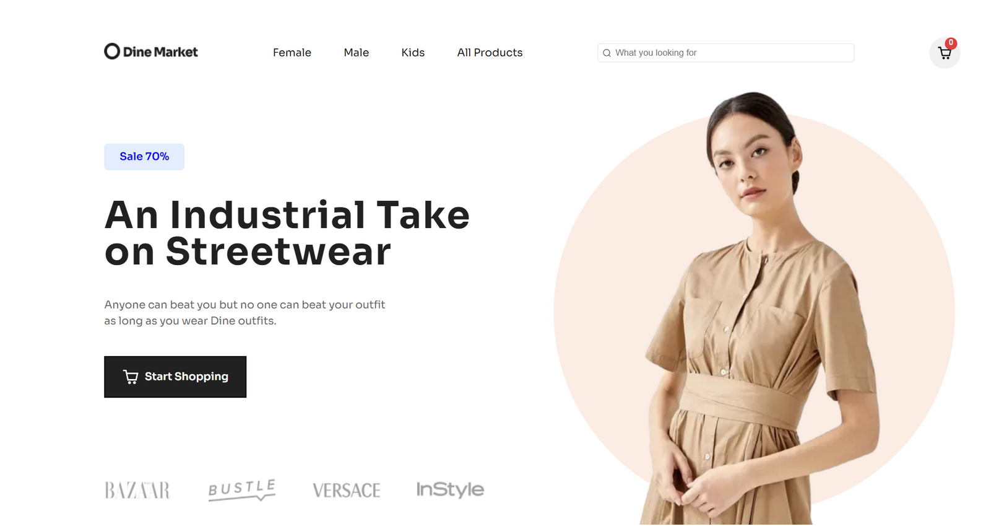
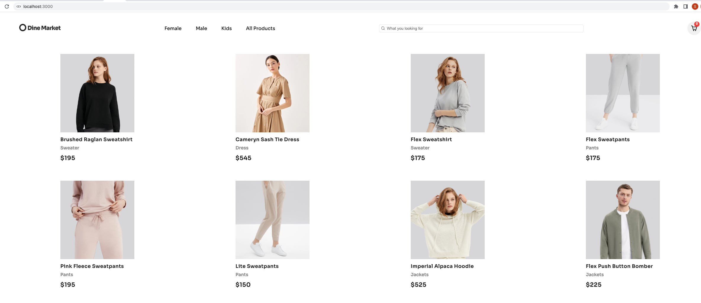
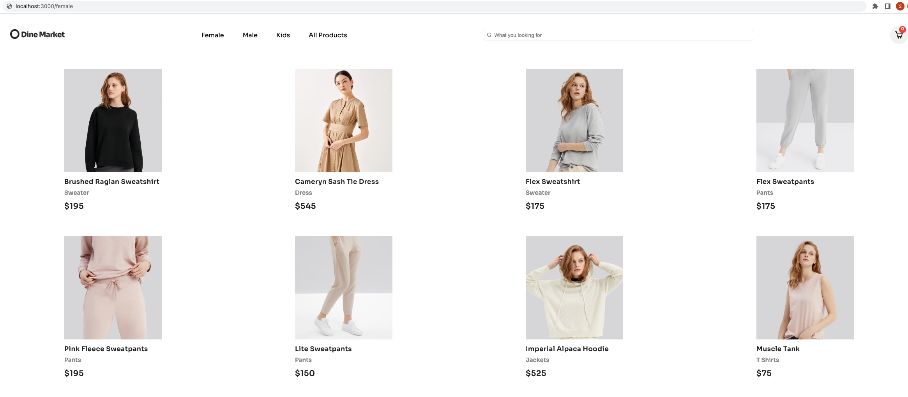
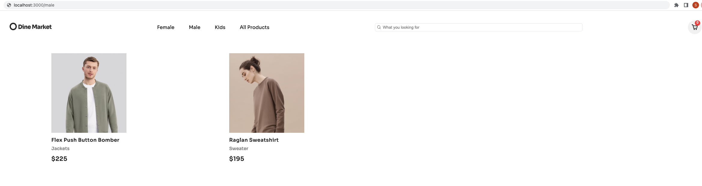
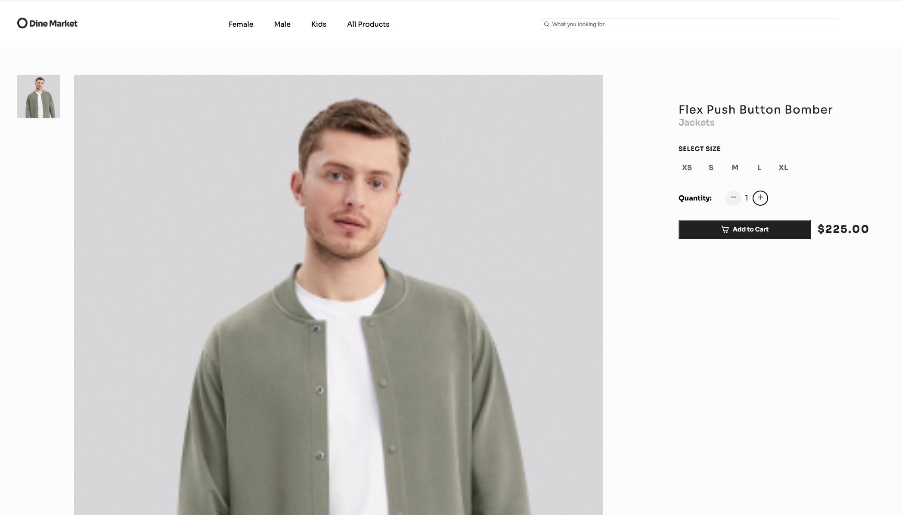
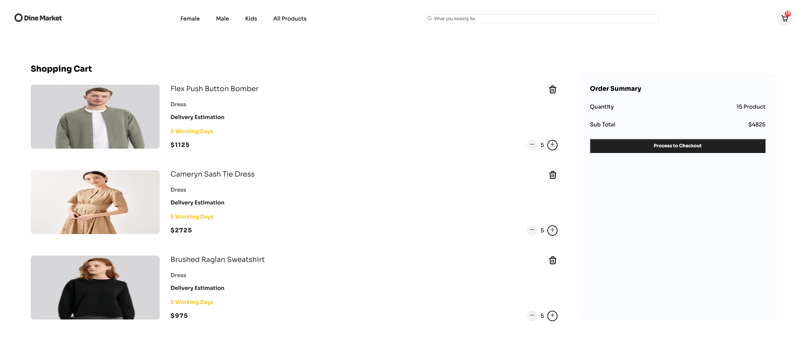

# Full Stack E-Commerce Clothing Website

This project is a full stack e-commerce website built with Next js. I created this project as an exercise to develop my web development skills, especially to learn about Next js.

# Table of contents

- Overview:

  > The challenge
  > Screenshot.

- My process:

  > Built with

# Overview

- The challenge

  > Build out the project to the designs provided
  > Implementing cart functionality
  > Connecting to Sanity as back end database for e-commerce
  > Connecting Stripe APIs to power online payment processing for e-commerce

- Screenshot

